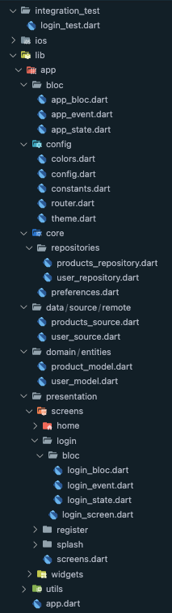

# Prueba técnica para Ancient
# Arquitectura:

Este proyecto está realizado con una mezcla de Clean Architecture y BLoC

|Directorio|Descripción|
|----------|-----------|
|/.dart_tool/flutter_gen/gen_l10n|Los genera flutter_localizations para el manejo de idiomas|
|/lib/l10n|Archivos .arb dónde se encuentran las llaves y valores de los textos de la app en diferentes idiomas|
|-|-|
|/app|Es dónde se encuentra todo el código del proyecto|
|-|-|
|/app/config/router|Está toda la configuración de las rutas (navegación) de las pantallas dentro de la app|
|/app/config/theme|Está todoa la configuración de los colores y estilos de texto|
|/app/config/constants|Está toda la configuración para la URL base para las API's usadas|
|-|-|
|/app/core/repositories|Se encuentran las declaraciones de los métodos para acceder a la api|
|/app/data/sources|Se encontrarán los métodos con su lógica para obtenr los datos remotos o locales |
|-|-|
|/app/domain/entities|Archivos con las clases de todos los modelos usados en los repositorios y dentro de la app|
|-|-|
|/app/presentation/|Estarán los archivos referentes a las pantallas y widgets a mostrar en la app|
|/app/presentation/bloc|BLoC general de la app|
|/app/presentation/widgets|Widgets que son compartidos en diferentes pantallas|
|/app/presentation/screens|Pantallas que se muestran en la app, separadas por cada sección o módulo. Cada carpeta tiene su BLoC y sus widgets individuales que sólo se usan en esa pantalla |
|-|-|
|/app/utils|Se encuentran los archivos con los métodos de ayuda|
|-|-|
|/test|Archivos con los test unitarios del proyecto|
|/integration_test|Archivos con los test de integración|
|/_screenshots|Archivos de muestra para evidenciar el diseño de la app|

\* NOTA: Por falta de tiempo sólo se cubrieron algunos BLoC's dejando pendiente algunos otros test

----

## Pantallas de muestra

||
|
|
|
|

----

### Cualquier duda o comentario estoy a sus órdenes.